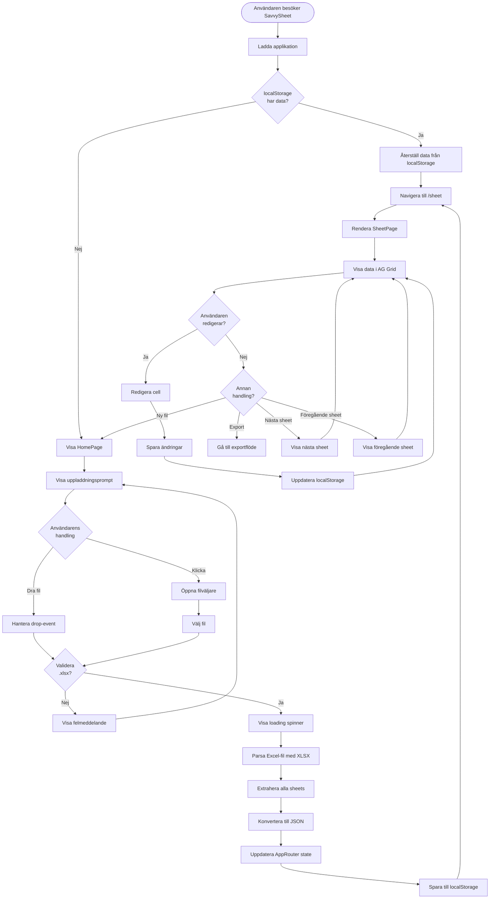
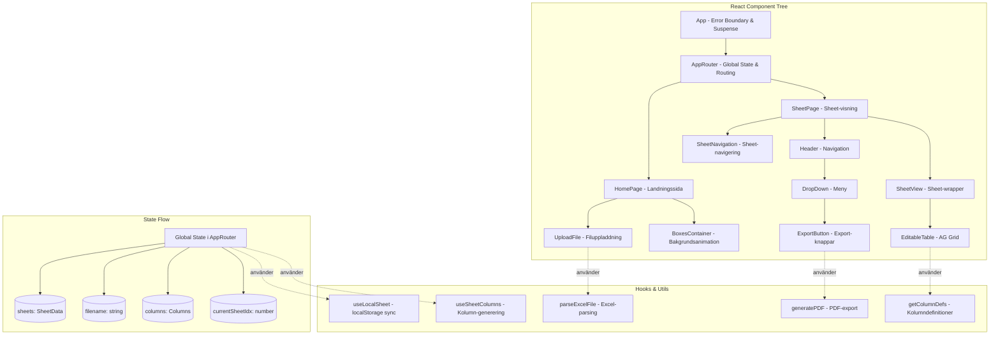
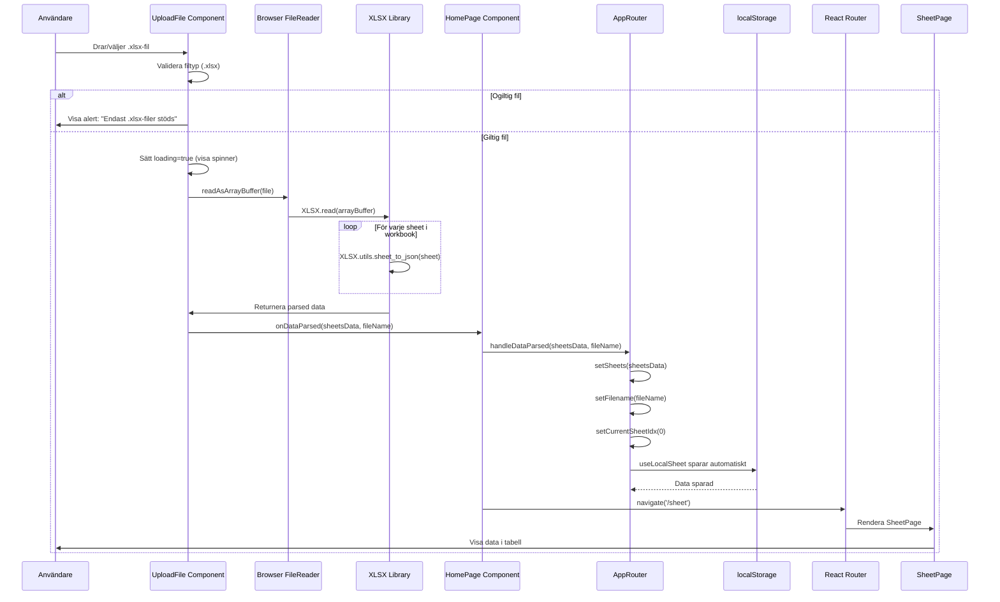
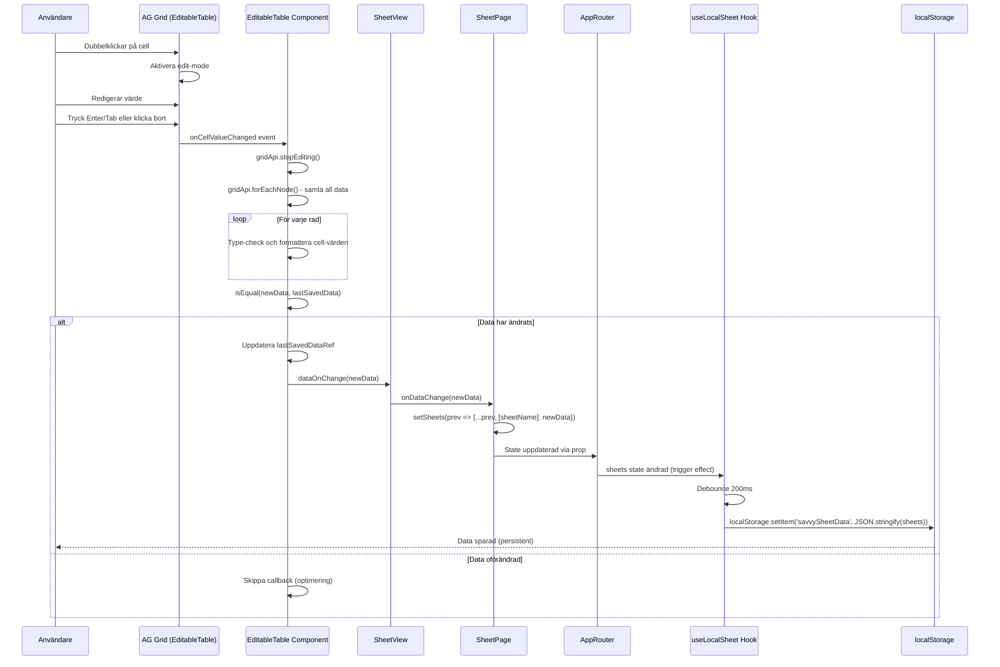
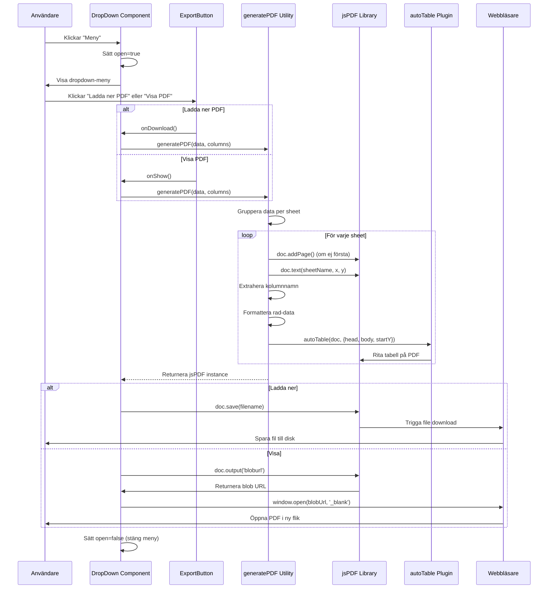
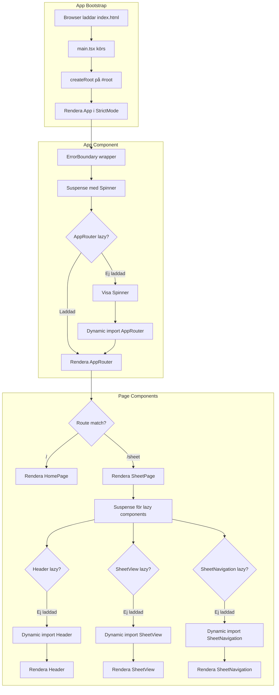

# SavvySheet - Applikationsflöde

Detta dokument beskriver det kompletta flödet i SavvySheet-applikationen med hjälp av Mermaid-diagram.

## Huvudflöde - Användarinteraktion



## Komponenthierarki och Dataflöde



## Filuppladdningsflöde (Detaljerat)



## Data-redigeringsflöde (AG Grid)



## PDF-exportflöde



## localStorage Persistens-flöde

```mermaid
graph TB
    subgraph "Initial Load - useLocalSheet Effect 1"
        Mount[Component Mount] --> LoadEffect[Load Effect körs]
        LoadEffect --> GetItem[localStorage.getItem('savvySheetData')]
        GetItem --> HasData{Data finns?}
        
        HasData -->|Ja| ParseJSON[JSON.parse(data)]
        HasData -->|Nej| SetLoaded1[hasLoaded.current = true]
        
        ParseJSON --> ValidJSON{Giltig JSON?}
        ValidJSON -->|Ja| SetState1[setSheetData(parsed)]
        ValidJSON -->|Nej| LogError[console.error] --> SetLoaded1
        
        SetState1 --> LoadFilename[Ladda filnamn]
        LoadFilename --> SetLoaded1
        SetLoaded1 --> StateReady[State redo för app]
    end
    
    subgraph "Data Change - useLocalSheet Effect 2"
        DataChange[sheets eller filename ändras] --> CheckLoaded{hasLoaded?}
        CheckLoaded -->|Nej| Skip1[Skippa - första load]
        CheckLoaded -->|Ja| CheckEmpty{Data tom?}
        
        CheckEmpty -->|Ja| Skip2[Skippa - ingen data att spara]
        CheckEmpty -->|Nej| SetTimeout[setTimeout 200ms]
        
        SetTimeout --> Debounce{200ms gått?}
        Debounce -->|Ny ändring| ClearTimeout[clearTimeout] --> SetTimeout
        Debounce -->|Ja| SaveFunction[save function]
        
        SaveFunction --> Stringify[JSON.stringify(sheetData)]
        Stringify --> SetItem[localStorage.setItem]
        SetItem --> SaveFilename{Filnamn finns?}
        
        SaveFilename -->|Ja| SetFilenameItem[localStorage.setItem(filename)]
        SaveFilename -->|Nej| Done[Sparning klar]
        SetFilenameItem --> Done
    end
    
    StateReady -.->|Användaren gör ändringar| DataChange
```

## Routing och Navigation

```mermaid
graph LR
    subgraph "Routes"
        Root[/ - HomePage]
        Sheet[/sheet - SheetPage]
    end
    
    subgraph "Navigation Triggers"
        FileUpload[Fil uppladdad] -->|navigate to| Sheet
        NewFileBtn[Ny fil-knapp] -->|navigate to| Root
        DirectURL[Direkt URL] -->|load| RouteMatch{Matcha route}
        LocalStorageData[localStorage data finns] -->|auto| Sheet
    end
    
    RouteMatch -->|/| Root
    RouteMatch -->|/sheet| Sheet
    RouteMatch -->|Okänd| Root
    
    subgraph "GitHub Pages Fix"
        NotFound[404 från GitHub Pages] --> SavePath[Spara path i sessionStorage]
        SavePath --> RedirectIndex[Redirect till index.html]
        RedirectIndex --> ScriptRun[Script i index.html]
        ScriptRun --> RestorePath[Återställ path med History API]
        RestorePath --> ReactRouter[React Router tar över]
    end
```

## Komponent Lifecycle och Lazy Loading



## Prestanda och Optimeringar

```mermaid
graph TB
    subgraph "Code Splitting"
        Bundle[Main Bundle] --> CoreCode[Core Code - App, AppRouter]
        Bundle --> LazyRoute[Lazy Routes - HomePage, SheetPage]
        Bundle --> LazyComponents[Lazy Components - Header, SheetView, etc.]
        Bundle --> LazyUtils[Lazy Utils - parseExcelFile dynamisk import]
        Bundle --> LazyBackgrounds[Lazy Backgrounds - BoxesContainer]
    end
    
    subgraph "Memoization"
        SheetPageMemo[SheetPage] --> UseMemoSheetNames[useMemo för sheetNames]
        SheetPageMemo --> UseMemoFlatColumns[useMemo för flatColumns]
        
        UseSheetColumns[useSheetColumns] --> UseMemoColumns[useMemo för columns]
        
        EditableTable[EditableTable] --> UseCallbackSave[useCallback för saveData]
        
        BoxesContainer[BoxesContainer] --> MemoBox[memo() för Box-komponenter]
    end
    
    subgraph "localStorage Optimering"
        DataChange[Data ändras] --> Debounce[200ms debounce]
        Debounce --> SingleWrite[En write operation]
        Debounce -.->|Utan debounce| MultipleWrites[Många writes]
    end
    
    subgraph "AG Grid Optimering"
        LargeDataset[Stor dataset] --> Virtualization[AG Grid virtualisering]
        Virtualization --> OnlyVisible[Rendera endast synliga rader]
        OnlyVisible --> FastScroll[Snabb scrolling]
        
        CellEdit[Cell-redigering] --> StopEditing[stopEditing innan save]
        StopEditing --> ForEachNode[forEachNode för data]
        ForEachNode --> IsEqual[isEqual check]
        IsEqual -->|Oförändrad| SkipCallback[Skippa callback]
        IsEqual -->|Ändrad| TriggerCallback[Trigga callback]
    end
```

Detta flödesdiagram ger en komplett översikt av hur SavvySheet fungerar från initial laddning till export och persistens.
